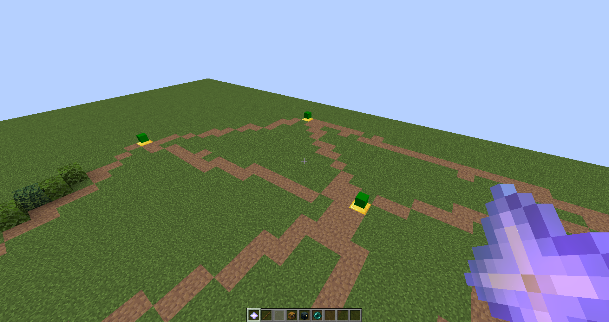
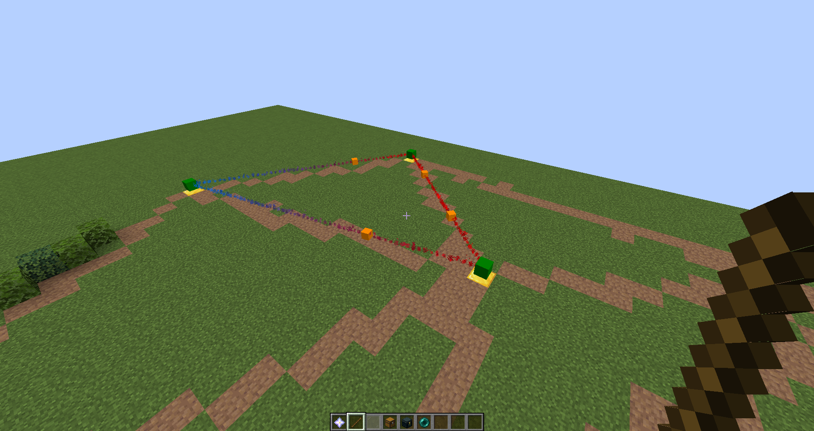
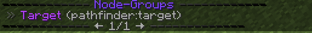
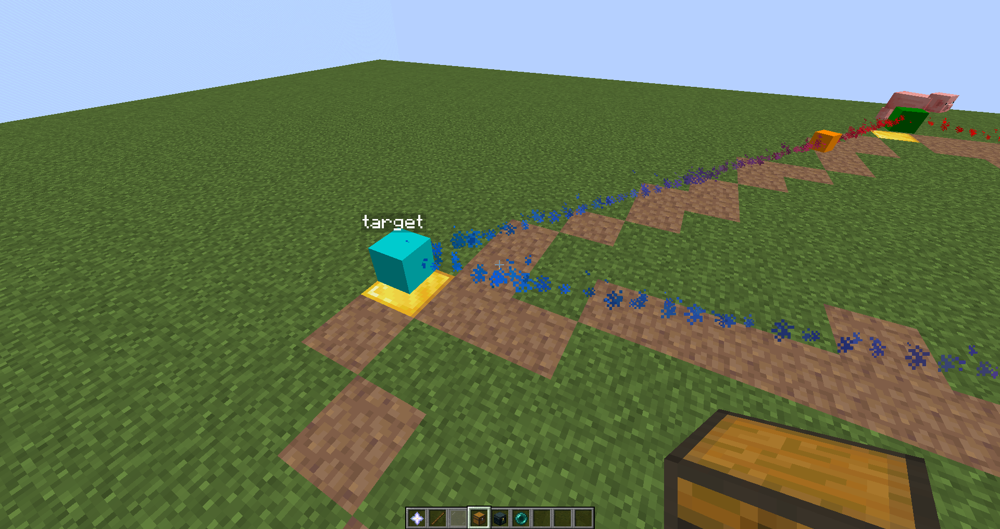
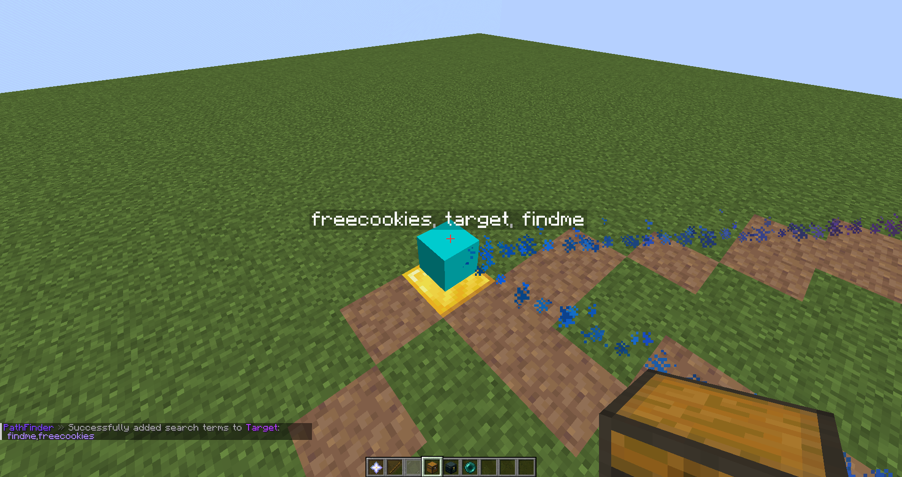
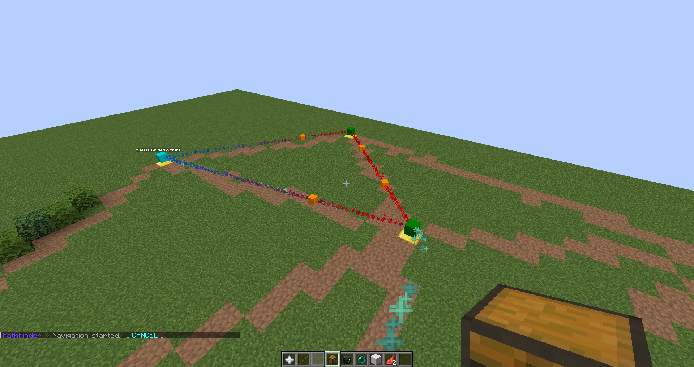
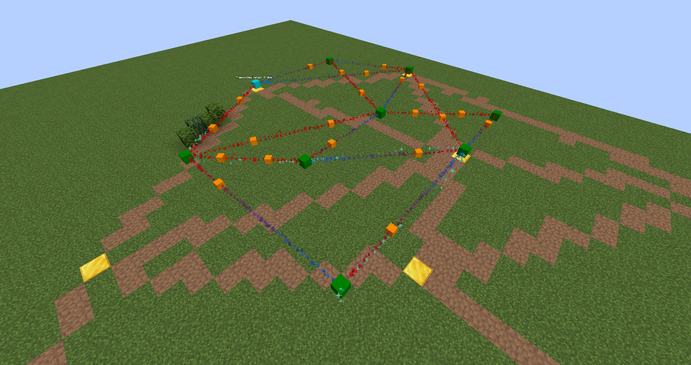

# Guide

This guide is a work-along guide to set up a roadmap for a town with discoverable points
of interest and search terms for proper navigation.

Your players will be able to find the shortest path to any location within your roadmap easily.

If you have any problems with the plugin, check out [our discord server](https://discord.gg/wDecCCRXFv) and ask for help!

## Preparations

There is not much to do. [Install the plugin](/getting_started/installation.html) first and start up your server.
In your plugins folder a directory with name "PathFinder" will appear. It contains all data and configuration files.

To get started, the default [configuration](/configuration/config.html) should be sufficient, but feel free to
have a look at it and change the settings to your liking.

Join your server and follow along with the steps below.

## Roadmap

First of all, you may want to create a RoadMap. RoadMaps are bundles of waypoints and connecting
edges. Choose one RoadMap for one Region that is logically separated. For example, create one
RoadMap for a maze minigame in your lobby and a separate one for your RPG map.

Do this with the command below, where key is anything that fits your context most.
<CmdLine>
    /rm create
    <CmdArg :index="0" type="nskey" label="key"></CmdArg>
</CmdLine>

For the sake of this tutorial, I will use the name "town".
<CmdLine>
    /rm create
    <CmdArg no-wrapper :index="0" type="nskey" label="town"></CmdArg>
</CmdLine>

## Edit Mode

Now that we successfully created our RoadMap, lets jump right into the edit mode and add some
waypoints.

Do this by entering
<CmdLine>
/rm editmode
<CmdArg no-wrapper :index="0" type="nskey" label="pathfinder:town"></CmdArg>
</CmdLine>

You will notice, that parts of your hotbar have changed to a hotbar menu.
We will use this menu to create and modify waypoints, edges and nodegroups.

### Create Waypoints

Let's use the node tool to create a waypoint. To do this, select the node tool and right click any
block. The location of the clicked block will be used as waypoint position and a green player head
appears.

Let's place some more. You can also remove them by left-clicking.

### Create Edges

Once that is done, you may want to connect them with edges.
Select the edge tool and right-click any waypoint. You then have started the connect-mode.
Click a second waypoint and a connection has been made.

You will notice that a connection is represented with particles, fading from red to blue.
This indicates the direction of the edge. Players can only ever move from red to blue.

Add a second edge in the opposite direction to make it bidirectional

::: tip
You may not need many directional edges. Left-click once into the air to toggle the edge tool.
Now every new edge will be bidirectional automatically.
:::

### Delete Edges

Every edge comes with an edge handle for each direction. Edge handles are orange player heads and
clickable, just like waypoints. Left-click an edge handle with your edge tool to remove a connection
between two waypoints.
Left-click a waypoint instead, if you want to remove all connections going FROM this waypoint.

### Defining Node Groups

Well, there we have our graph. But it cannot do much yet.
Let's add some functionality.

Nodegroups are modifiers for multiple waypoints.
Assign a group to make a waypoint findable, discoverable, add a permission check and more.
If a group applies to multiple waypoints, the behaviour of all contained waypoints can be
changed by altering the group.

Use the following command to create a new group.
<CmdLine>
    /nodegroup create
    <CmdArg :index="0" type="nskey" label="group-name"></CmdArg>
</CmdLine>

I will call my tutorial group "target", because my group shall be navigable when using `/find`
<CmdLine>
    /nodegroup create
    <CmdArg :index="0" noWrapper type="nskey" label="target"></CmdArg>
</CmdLine>

Let's see if our group is available:
<CmdLine>/nodegroup list</CmdLine>

And indeed, our group was successfully created.

To add a waypoint to a group,s elect the "Assign Group" tool and right-click the according
waypoint. A menu will open up that contains all nodegroups. Choose your nodegroup.
Immediately, the waypoint will turn blue and the name of the group will appear above it.

This might be misleading, because the word above is actually not the name of the group, but
the list of all search terms that describe this waypoint. This means, that our waypoint is now
findable when using the search term "target".

### Add Search Terms

To add more search terms or remove the default one, use the following commands:

<CmdLine>
    /nodegroup search-terms add|remove
    <CmdArg :index="0" type="nodegroup" label="group"></CmdArg>
    <CmdArg :index="1" type="string" label="terms"></CmdArg>
</CmdLine>

You may want to join your search terms with a comma, like so:
<CmdLine>
/nodegroup search-terms add|remove
<CmdArg :index="0" noWrapper type="nodegroup" label="pathfinder:target"></CmdArg>
<CmdArg :index="1" noWrapper type="string" label="findme,freecookies"></CmdArg>
</CmdLine>

## Visualizers

Before we can start to find our group, we may want to create a path visualizer.
As the name already indicates, a path visualizer will create any kind of visualization
for the shortest path to our target.
This can practically be anything from particles to a villager that shows you the way or
a compass in hand that always points into the right direction.

There are some default visualizers that come with the plugin by itself, but developers
are highly encouraged to try and implement some by themselves and share them with the community! :D

### Create a Visualizer

To create a visualizer, we first have to choose a type.
To keep things simple, we will use a particle visualizer.

<CmdLine>
/visualizer create
<CmdArg :index="0" type="vis-type" label="type"></CmdArg>
<CmdArg :index="1" type="string" label="name"></CmdArg>
</CmdLine>
<CmdLine>
/visualizer create
<CmdArg :index="0" noWrapper type="vis-type" label="pathfinder:particle"></CmdArg>
<CmdArg :index="1" noWrapper type="string" label="hearts"></CmdArg>
</CmdLine>

Once we created our first visualizer, lets assign it to our roadmap and check out how it looks.

<CmdLine>
/roadmap edit
<CmdArg :index="0" noWrapper type="roadmap" label="pathfinder:town"></CmdArg>
visualizer
<CmdArg :index="1" noWrapper type="vis" label="pathfinder:hearts"></CmdArg>
</CmdLine>

We can use the ``/find`` command to start a navigation from our current location to the first node
that matches the according search-term.

<CmdLine>
/find
<CmdArg :index="0" noWrapper type="string" label="target"></CmdArg>
</CmdLine>

Et voilà, our first path appears.

I will quickly build a more complex setup to show that /find will actually use the shortest path.

### Changing particles

You can change the settings of a visualizer all to your likings. Have a closer look at the
pages of this wiki if you want a detailed list of all properties and how they affect the outcome.

To end this short guide to get started with the plugin, I will set the particles for our
visualizer to actual hearts.

<CmdLine>
/visualizer edit particle
<CmdArg :index="0" noWrapper type="vis" label="pathfinder:hearts"></CmdArg>
particle
<CmdArg :index="1" noWrapper type="nskey" label="minecraft:hearts"></CmdArg>
</CmdLine>